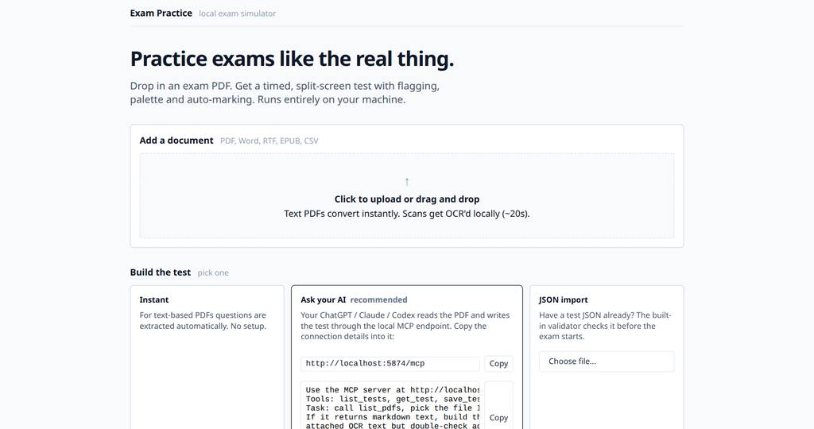
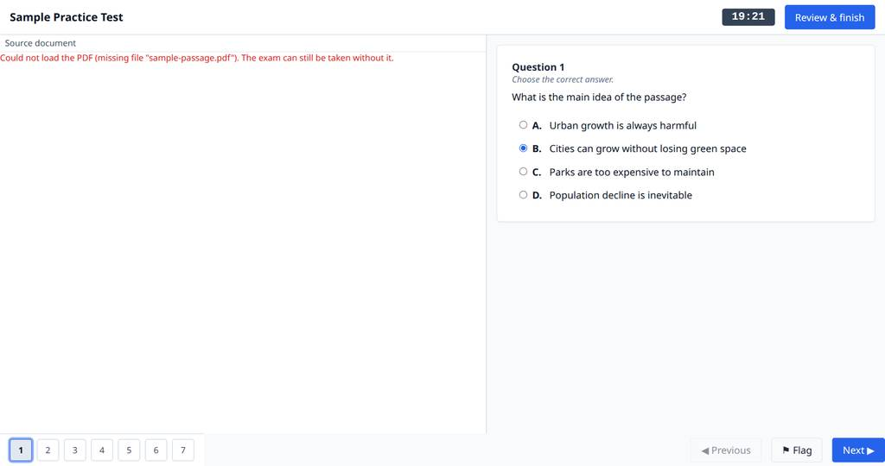
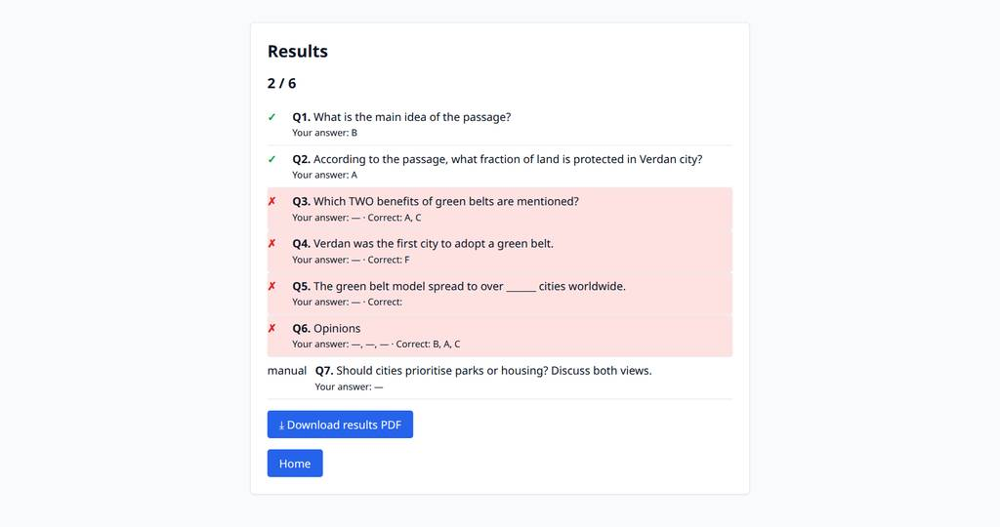

# TestPractice — local exam simulator


Drop an exam PDF in. Get a timed, real-feeling computer test: split-screen with the
source document, question palette, flagging, auto-marking, and a downloadable
results PDF. Runs 100% on your machine — no account, no server, no cloud.



## How it works

```text
exam PDF ──▶ TestPractice ──▶ timed split-screen exam ──▶ auto-marked results + printable PDF
                     (optional: your AI builds the test via local MCP)
```

1. **Add a document** — PDF, Word, RTF, EPUB or CSV. Text-based files parse instantly;
   scanned ones are OCR'd locally with Tesseract (~20 s for a 20-page scan).
2. **Build the test** — three ways:
   - **Instant**: text-based PDFs are extracted automatically.
   - **Ask your AI** (recommended): your own ChatGPT / Claude / Codex connects to the
     local MCP endpoint (`http://localhost:5874/mcp`, no installation) and writes the
     test JSON. A ready-made prompt is on the landing page.
   - **JSON import**: bring your own file; the validator checks it before the exam.
3. **Set up the attempt** — override the timer (custom minutes or untimed free practice)
   and pick which questions you want: quick-select range blocks (Q1–10, Q11–20 …) let
   you drill one chapter or section without touching the JSON.
4. **Take the exam** — countdown timer with auto-submit, question palette
   (○ unanswered ● answered ⚑ flagged ◉ current), split-screen passage view,
   autosave + resume, review-before-submit.
5. **Results** — auto-marking with per-question comparisons (right / wrong / manual),
   downloadable PDF summary.




Question types: `single_choice`, `multiple_choice`, `true_false` (T/F/N),
`text_input`, `matching`, `long_text`. Tests are plain JSON files — portable,
versionable, human- and AI-writable.

## Install

Download **one file** for your platform from
[Releases](https://github.com/shahabsalehi/testonini/releases):

| Platform | File |
|---|---|
| Windows 10/11 x64 | `TestPractice-windows-x64.zip` → `TestPractice.exe` |
| Linux x64 | `TestPractice-linux-x64.zip` → `TestPractice` |
| Apple Silicon (M1–M3) | `TestPractice-macos-arm64.zip` → `TestPractice` |
| macOS Intel (2014+) | see `PLATFORMS.md` — build locally on a Mac |

Unzip, double-click. A tray icon appears (open in browser / quit); the browser
opens automatically at `http://localhost:5874`. Everything — server, UI, PDF
renderer, parser, report writer — is inside the binary; `tests/` and `pdfs/`
folders are created next to it on first run.

Optional: install [Tesseract](https://github.com/tesseract-ocr/tesseract) for
local OCR of scanned PDFs (apt / brew / UB-Mannheim installer). Without it the
app still works — it just asks your AI to read the rendered pages instead.

## Development

No framework, no build step:

```bash
python3 server.py          # serves http://localhost:5874 (MCP at /mcp)
```

| File | Role |
|---|---|
| `server.py` | stdlib HTTP server: static files, `/upload-doc`, `/export-results`, MCP JSON-RPC (`list_tests` `get_test` `save_test` `validate_test` `list_pdfs` `parse_pdf` `prepare_test_from_pdf`) |
| `launch.py` | launcher: starts the server, opens the browser, tray icon to quit |
| `index.html` `app.js` `style.css` `pdf.js` | the app — vanilla JS, PDF.js vendored (no CDN) |
| `tests/*.json` | test files (schema validated by `validate_test` server-side and `validateTest` in `app.js`) |
| `build.sh` / `build.bat` | per-platform frozen builds (GitHub Actions does this per tag too) |

Security posture: binds to `127.0.0.1` only; filename validation on every route;
no telemetry, no accounts, fully offline (PDF.js is vendored — zero outbound calls).

## License

[Apache-2.0](LICENSE). Third-party: PDF.js (Apache-2.0), firecrawl-anydoc (MIT),
reportlab (BSD), PyInstaller (GPL with the bootloader exception covering the
bundled output), pystray (LGPL-3.0, dynamically linked), Pillow (MIT-CMU), Tesseract (Apache-2.0).